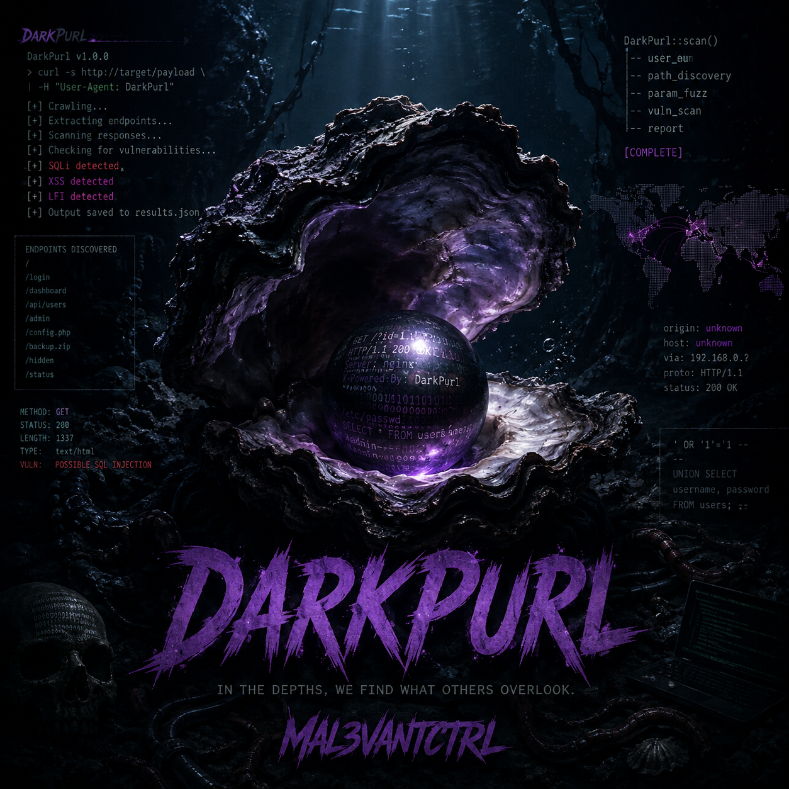

<p align="center">
  
</p>
<p align="center">
  
</p>
# DarkPurl

> **curl-native HTTP inspection & workflow tool for penetration testing and CTFs.**

---

## 🚧 Project Status

## What's New

### v2.0.0 — Auto-Scan & Vulnerability Flagging

The v2.0.0 release introduces automated vulnerability scanning, line-level vulnerability flagging, findings persistence, request comparison, state continuity, and a redesigned welcome experience.

See the full [CHANGELOG](CHANGELOG.md) for detailed release notes.
---

## Overview

DarkPurl is an interactive, menu-driven wrapper around curl that simplifies HTTP reconnaissance and testing workflows. Instead of remembering lengthy command-line syntax, DarkPurl guides you through building requests, inspecting responses, and working through common testing patterns — logins, API auth, session handling, and more — through a guided interface.

Beyond request building, DarkPurl can automatically crawl a target, probe common paths (or import results from dirb/gobuster/ffuf), and flag responses that look worth investigating — SQL/template injection signatures, exposed debug pages, IDOR patterns, misconfigurations, and more — each with a plain-English explanation of what it means.

Designed for penetration testers, students, and CTF players, DarkPurl streamlines repetitive web testing tasks while remaining lightweight, passive by design, and dependency-free.

---

## Features

* Interactive menu-driven interface
* Built on native `curl`
* HTTP request inspection and analysis
* Common penetration testing and CTF workflows
* Built-in request recipes
* Create and save custom recipes
* Display generated `curl` commands before execution
* Lightweight with no external dependencies

---

## Requirements

* Python 3.8+
* `curl`

---

## Installation

Clone the repository:

```bash
git clone https://github.com/Mal3vAntCtrl/DarkPurl.git
cd DarkPurl
```

Run the tool:

```bash
python3 darkpurl.py
```

---

## Example Workflow

1. Enter the target host or IP address.
2. Select a workflow category.
3. Choose a built-in recipe.
4. Provide only the required information.
5. Review the generated `curl` command.
6. Execute the request and inspect the response.
7. Save customized workflows for future use.

---

## Example Use Cases

* Web application reconnaissance
* HTTP endpoint testing
* Authentication testing
* API exploration
* Header inspection
* Cookie analysis
* CTF web challenges
* Learning and practicing `curl`

---

## Roadmap

### Completed (v1.0)

* ✅ Interactive menu-driven interface
* ✅ curl-native HTTP workflows
* ✅ Built-in workflow recipes
* ✅ Custom recipe persistence
* ✅ Request preview before execution
* ✅ Response inspection

### Planned

* ⏳ Colorized response output
* ⏳ Session and cookie management
* ⏳ Automatic authentication workflows
* ⏳ Request history
* ⏳ Header and parameter fuzzing helpers
* ⏳ JSON response formatting
* ⏳ Proxy support
* ⏳ Export and import workflows
* ⏳ Additional pentesting and CTF recipes
* ⏳ Improved UI and usability enhancements

---

## Philosophy

DarkPurl focuses on making HTTP testing fast, repeatable, and transparent. Every generated request is displayed before execution so users understand exactly what is being sent while reducing the need to memorize complex `curl` syntax.

The goal is not to replace `curl`, but to make it easier to learn, faster to use, and more accessible during web assessments and CTFs.

---

## Contributing

DarkPurl is an actively evolving project. Contributions, bug reports, feature requests, and workflow suggestions are appreciated and help shape future releases.

---

## Disclaimer

This project is intended for authorized security testing, educational purposes, and Capture The Flag (CTF) environments only. Always obtain proper authorization before testing systems you do not own or have permission to assess.

---

## Author

**MAL3VANTCTRL**
